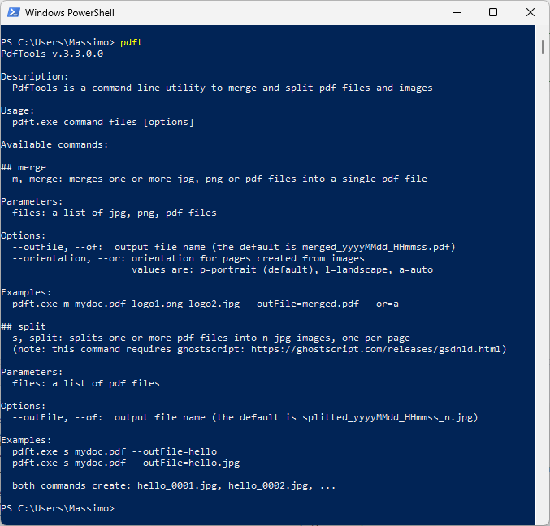

PdfTools
==============

PdfTools is an utility to merge and split pdf files and images

## Usage
See command help:

# Todo
- ~~split command~~
- ~~handle ghostscript not installed error~~
- ~~landscape option~~
- page size and image quality options
- better command line args handling

# Dependencies

## Libraries
- Magick.NET.Core
- PdfSharpCore

## Software
- [Ghostscript](https://ghostscript.com/releases/gsdnld.html) needs to be installed on your machine (*split* command only)

## License
GNU GENERAL PUBLIC LICENSE V 3

---

Copyright (C) [Massimo Barbieri](http://www.massimobarbieri.it) 
